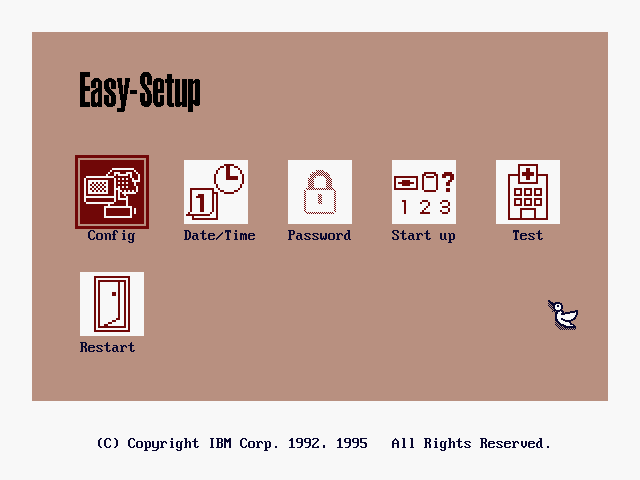

# PS2GUI
## A *graphical* system manager for the IBM PalmTop PC110

*Version 0.1 · by Ahmad Byagowi*

A GUI fork of [PS2TUI](https://github.com/ahmadexp/PS2TUI) that dresses the PC110's configuration
tool in the machine's own **IBM Easy-Setup** look — the mauve desktop, the white icon tiles with
dark-red line art, the stylized *Easy-Setup* title, the little duck, and the copyright line.



*PS2GUI running in VGA mode 12h (captured in QEMU). Compare it to the real Easy-Setup — it is
pixel-for-pixel identical.*

### The graphics are the real thing

The artwork is **not redrawn** — it is lifted straight from a pixel-exact capture of the PC110's
real Easy-Setup screen. The 640×480 image uses just six colours, so it maps cleanly onto **VGA mode
12h (640×480×16)**:

- The whole screen is converted to the **four VGA bit-planes**, each **RLE-compressed** (the large
  flat mauve areas collapse to almost nothing — the entire screen is ~14 KB of data).
- At start-up PS2GUI sets mode 12h, loads the exact Easy-Setup **palette** into the DAC (mauve /
  white / dark-red / navy / black), then blits the four planes 1:1 into video memory.
- Result: the Config, Date/Time, Password, Start up, Test and Restart icons, the title, and the duck
  are the genuine Easy-Setup bitmaps (`ESDATA.INC`, auto-generated by `tools/extract_es.py`).

### Status

**v0.1** renders the exact Easy-Setup main screen and lets you move a red **selection box** across
the six icons with the arrow keys — just like the real thing. Wiring each icon to its function is the
next phase:

| Icon | Planned action |
|---|---|
| **Config** | the PS2 settings (power, display, devices, keyboard, advanced) |
| **Date/Time** | live RTC set/read |
| **Password** | power-on password (where supported) |
| **Start up** | boot-order / start-up options |
| **Test** | the hardware diagnostics (CPU / SCAMP / PCIC / MCU / RTC …) |
| **Restart** | warm-reboot the machine — **works now** |

The heavy lifting for those functions already exists in **PS2TUI** (APM/CMOS/SCAMP/PCIC/8042 code);
PS2GUI will call into the same routines, drawing their output in the Easy-Setup style.

### Keys

| Key | Action |
|---|---|
| ← ↑ / → ↓ | Move the selection box between icons |
| Enter | Activate the icon (**Restart** reboots; others: coming next) |
| ESC | Quit back to DOS (restores the previous video mode) |

### Building

Requires [NASM](https://nasm.us). The prebuilt `PS2GUI.COM` in this repo is the assembled binary.

```sh
make            # or:  nasm -f bin PS2GUI.ASM -o PS2GUI.COM
```

`ESDATA.INC` (the embedded Easy-Setup graphics) is regenerated from the source capture with
`tools/extract_es.py` — you only need to rerun it if you change the artwork.

## Relation to the PC110 project

PS2GUI is part of the [Open-Source-PC110](https://github.com/ahmadexp/Open-Source-PC110)
reverse-engineering effort and shares its non-commercial [CC BY-NC 4.0](LICENSE) licence. The
Easy-Setup itself is © IBM Corp. 1992, 1995 — the graphics are reproduced here for interoperability
and preservation of this long-obsolete machine.
