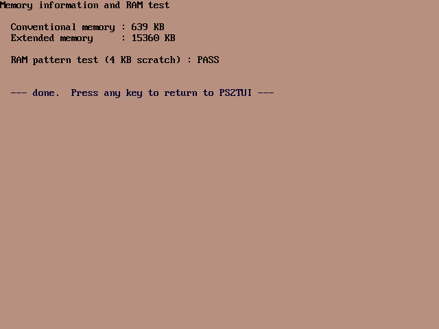
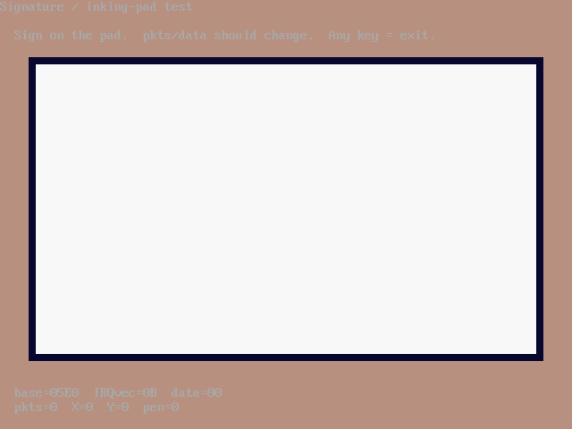

# PS2GUI
## A *graphical* system manager for the IBM PalmTop PC110

*Version 1.5 · by Ahmad Byagowi*

A GUI fork of [PS2TUI](https://github.com/ahmadexp/PS2TUI) that reproduces the PC110's own
**IBM Easy-Setup** skin — the white screen border with the inset mauve panel, the exact DAC palette,
the white icon tiles in a **5×2 grid**, the heavy condensed title lettering, and **mouse support with
the authentic Easy-Setup duck cursor that flaps its wings as it moves** — running entirely in
**VGA mode 12h (640×480×16)**.


*The main menu is an Easy-Setup icon grid: a 5×2 layout, one tile per top-level category, at the same
tile positions and colours as the real Easy-Setup. The selected tile is inverted (dark-red).*

### A true Easy-Setup icon grid, with a hand-drawn icon for every item

The menus are **icon grids**, just like the machine's Easy-Setup:

- **Main menu** = a grid of **ten tiles**, one per PS2TUI category, each with a detailed pixel-art
  icon (battery-with-bolt, a monitor showing a picture, a plug & socket, keyboard + pointer, twin
  gears, a memory chip, a test clipboard, a magnifier over a heartbeat, a floppy with a restore
  arrow, an info circle).
- **Open a tile → a new icon-grid page** for that category — and **every individual item has its own
  icon** chosen for what it means: a leaf for *power-saving*, a moon for *auto-suspend*, a gauge for
  *CPU speed*, a clamshell for *cover-close*, a speaker for *SoundBlaster*, a **pen for the digitizer /
  inking pad**, infrared waves, a serial connector, a modem, a PC-card, a printer for *LPT*, a hard
  disk for *ATA*, a stopwatch for the *timer test*, a mouse for the *pointing-device test*, magnifier-
  badged icons for the *diagnostics*, and so on.
- **Selection** is shown Easy-Setup-style: the current tile is **inverted** (dark-red tile, light
  icon). Move with the **arrow keys** in two dimensions, or point and click.
- **Value pickers** (High / Medium / Low, COM1 / COM2, …) open a centred **Easy-Setup-style dialog**
  — a white window with a drop shadow, a red title bar, and the current value on a red selection bar.

| Screen | |
|---|---|
| Main menu — 10 category tiles |  |
| Devices — incl. the inking digitizer |  |
| System Test — tests & diagnostics |  |
| A value-picker dialog |  |

The layout is measured straight off a real Easy-Setup capture: a **white screen** with the **mauve
panel** inset at (32,32)–(607,400), the copyright on the white margin below it, a **5×2 grid** of white
tiles at the exact pitch (tiles at x = 80 + col·104, y = 160 + row·112), the five-colour DAC palette
lifted pixel-for-pixel, and the title in a heavy condensed upright face to mirror the "Easy-Setup"
lettering. Long labels word-wrap to up to three ≤12-char lines so they never spill into neighbours.

The tile artwork — ~50 detailed 48×48 icons, the "PS2-GUI" title and the two-frame duck cursor — is
generated by `tools/make_tiles.py` into `TILES.INC`. Everything is drawn in mode 12h on the mauve
Easy-Setup desktop; there is **no text-mode menu** anywhere.

### The menu structure is identical to PS2TUI

All ten categories, all items, all option lists are shared with PS2TUI:

> Power & Battery · Display · Devices · Keyboard & Pointer · Advanced · Dumps & ROM · System Test ·
> Diagnostics · Backup & Restore · Information

The whole PS2TUI engine (APM / CMOS / SCAMP / PCIC / 8042 / dumps / diagnostics) is built in, so no
external `PS2TUI.COM` is needed — PS2GUI is self-contained. **Dumps & ROM** also dumps the **CMOS**,
and the **Start up** boot-order and other advanced settings are exposed as their own tiles.

### System Test — including two that talk to the pointing hardware directly


The test, dump and diagnostic report pages themselves render on the graphical Easy-Setup page (the
mauve panel with dark text), matching the rest of the UI:



*(The **Video / colour test** is the one exception — it deliberately stays in real text mode, because
its whole job is to show the text attributes and the CP437 character set.)*

The **System Test** page runs local diagnostics — memory/RAM, video & colour, keyboard, speaker beep,
the live real-time clock, and the PIT timer — plus two that drive the PC110's pointing hardware with
no external driver:

- **Pointing device test** — reads the built-in **trackpad (U75, NEC µPD17137A)** straight off the
  8042 aux channel and shows live X / Y / buttons. Works even with no INT 33h mouse driver loaded.
- **Signature pad test** — drives the PC110's **resistive inking digitizer** (the "signature pad")
  directly: it hooks the inking IRQ, enables the pad, decodes its 3-byte packets, and lets you
  **sign on the pad and see your strokes** in a signing box. See the reverse-engineering write-up in
  [Open-Source-PC110 · Discovery/Inking](https://github.com/ahmadexp/Open-Source-PC110/tree/main/Discovery/Inking).



### Mouse — the real trackpad, with the flapping duck


PS2GUI drives the PC110's **built-in trackpad directly** over the 8042 aux port (IRQ 12), so the
cursor works with **no INT 33h driver** — if a driver *is* loaded it uses that instead. The pointer is
the machine's own **Easy-Setup duck**, and it **flaps its wings as it moves** (two frames, wings
up/glide and wings down) just like the real Easy-Setup cursor. **Left-click** a tile to open it, an
item to pick its value, or a value to choose it; **right-click** goes back one level. Without a mouse
everything still works from the keyboard.

### Keys

| Key | Action |
|---|---|
| ← ↑ ↓ → | Move the selection around the icon grid |
| Enter | Open a category / choose an item / pick a value |
| ESC | Back one level; on the main menu, quit to DOS (restores the text mode) |
| Mouse | Left-click = open/choose · right-click = back |

### The Easy-Setup palette is the real thing

The five-colour DAC palette (mauve / white / dark-red / navy / black) is lifted from a pixel-exact
capture of the PC110's real Easy-Setup screen (`ESDATA.INC`), so the colours match the machine exactly.

### Building

Requires [NASM](https://nasm.us). The prebuilt `PS2GUI.COM` in this repo is the assembled binary.

```sh
make            # or:  nasm -f bin PS2GUI.ASM -o PS2GUI.COM
```

## Relation to the PC110 project

PS2GUI is part of the [Open-Source-PC110](https://github.com/ahmadexp/Open-Source-PC110)
reverse-engineering effort and shares its non-commercial [CC BY-NC 4.0](LICENSE) licence. The
Easy-Setup itself is © IBM Corp. 1992, 1995 — its look is reproduced here for interoperability and
preservation of this long-obsolete machine.
