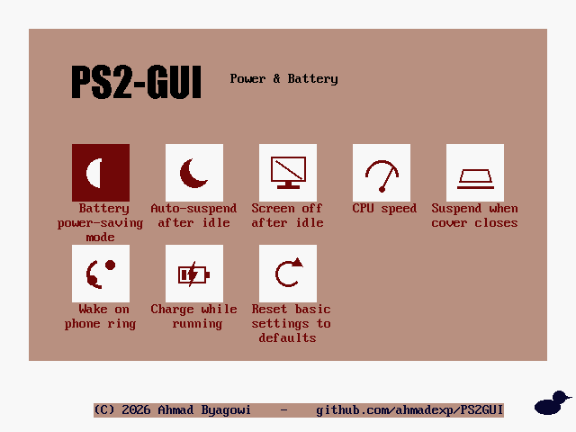
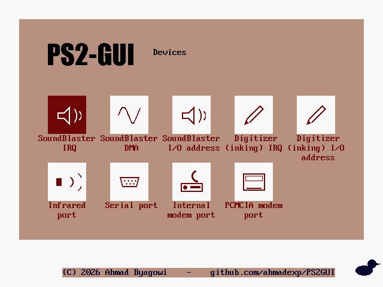
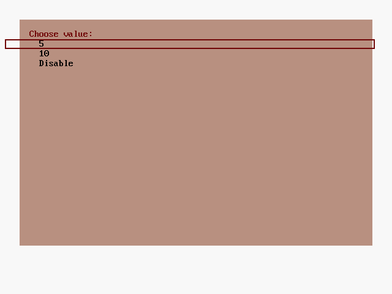

# PS2GUI
## A *graphical* system manager for the IBM PalmTop PC110

*Version 1.0 · by Ahmad Byagowi*

A GUI fork of [PS2TUI](https://github.com/ahmadexp/PS2TUI) that reproduces the PC110's own
**IBM Easy-Setup** skin — the white screen border with the inset mauve panel, the exact DAC palette,
the white icon tiles in a **5×2 grid**, the heavy condensed title lettering, the little duck —
running entirely in **VGA mode 12h (640×480×16)**.


*The main menu is an Easy-Setup icon grid: a 5×2 layout, one tile per top-level category, at the same
tile positions and colours as the real Easy-Setup. The selected tile is inverted (dark-red).*

### A true Easy-Setup icon grid, with a hand-drawn icon for every item

The menus are **icon grids**, just like the machine's Easy-Setup:

- **Main menu** = a grid of **ten tiles**, one per PS2TUI category, each with a detailed pixel-art
  icon (battery-with-bolt, a monitor showing a picture, a plug & socket, keyboard + pointer, twin
  gears, a memory chip, a test clipboard, a magnifier over a heartbeat, a floppy with a restore
  arrow, an info circle).
- **Open a tile → a new icon-grid page** for that category — and **every individual item has its own
  icon** chosen for what it means: a leaf for *power-saving*, a moon for *auto-suspend*, a gauge for
  *CPU speed*, a clamshell for *cover-close*, a speaker for *SoundBlaster*, a pen for the *digitizer*,
  infrared waves, a serial connector, a modem, a PC-card, a printer for *LPT*, a hard disk for *ATA*,
  a stopwatch for the *timer test*, magnifier-badged icons for the *diagnostics*, and so on.
- **Selection** is shown Easy-Setup-style: the current tile is **inverted** (dark-red tile, light
  icon). Move with the **arrow keys** in two dimensions.
- **Value pickers** (High / Medium / Low, COM1 / COM2, …) are a short chooser list.

The layout is measured straight off a real Easy-Setup capture: a **white screen** with the **mauve
panel** inset at (32,32)–(607,400), the copyright on the white margin below it, a **5×2 grid** of white
tiles at the exact pitch (tiles at x = 80 + col·104, y = 160 + row·112), the five-colour DAC palette
lifted pixel-for-pixel, and the title in a heavy condensed upright face (Impact) to mirror the
"Easy-Setup" lettering. Long labels word-wrap to up to three ≤12-char lines so they never spill into
neighbouring tiles.

The tile artwork — ~50 detailed 48×48 icons, the "PS2-GUI" title and the duck — is generated by
`tools/make_tiles.py` into `TILES.INC` (`cat_tile[]` maps categories → icons, `row_icon[]` maps every
item → its icon). Everything is drawn in mode 12h on the mauve Easy-Setup desktop; there is **no
text-mode menu** anywhere.

*(v0.6 removed the old launcher + PS2TUI text menu; v0.7 list-with-icons; v0.8 a true icon grid; v0.9
a creative icon per item; v1.0 matches the Easy-Setup theme exactly — 5×2 grid, tile positions,
palette and title lettering.)*

| Screen | |
|---|---|
| Main menu — 10 category tiles |  |
| Power & Battery items |  |
| Devices items |  |
| A value picker |  |

### The menu structure is identical to PS2TUI

All ten categories, all items, all option lists are shared with PS2TUI:

> Power & Battery · Display · Devices · Keyboard & Pointer · Advanced · Dumps & ROM · System Test ·
> Diagnostics · Backup & Restore · Information

The whole PS2TUI engine (APM / CMOS / SCAMP / PCIC / 8042 / dumps / diagnostics) is built in, so no
external `PS2TUI.COM` is needed — PS2GUI is self-contained.

### What happens when you pick something

- A **setting** (e.g. *Power saving mode → High*) opens the graphical picker, then builds the real
  `PS2 …` (or `ULTRACHG …`) command and shows a confirm prompt before running the tool. The command
  is executed by the genuine PC110 tool, which is a text program — so that one confirm/run step is the
  only place the screen briefly leaves graphics; it returns to the menu automatically afterwards.
- A **diagnostic / test / dump** (e.g. *System Test*, *Diagnostics*) runs its report, then returns to
  the menu.

### Keys

| Key | Action |
|---|---|
| ← ↑ ↓ → | Move the selection around the icon grid |
| Enter | Open a category / choose an item / pick a value |
| ESC | Back one level; on the main menu, quit to DOS (restores the text mode) |

### The Easy-Setup palette is the real thing

The five-colour DAC palette (mauve / white / dark-red / navy / black) is lifted from a pixel-exact
capture of the PC110's real Easy-Setup screen (`ESDATA.INC`, generated by `tools/brand_es.py` from
`pc110-easy-setup.png`), so the colours match the machine exactly.

### Building

Requires [NASM](https://nasm.us). The prebuilt `PS2GUI.COM` in this repo is the assembled binary.

```sh
make            # or:  nasm -f bin PS2GUI.ASM -o PS2GUI.COM
```

## Relation to the PC110 project

PS2GUI is part of the [Open-Source-PC110](https://github.com/ahmadexp/Open-Source-PC110)
reverse-engineering effort and shares its non-commercial [CC BY-NC 4.0](LICENSE) licence. The
Easy-Setup itself is © IBM Corp. 1992, 1995 — its look is reproduced here for interoperability and
preservation of this long-obsolete machine.
